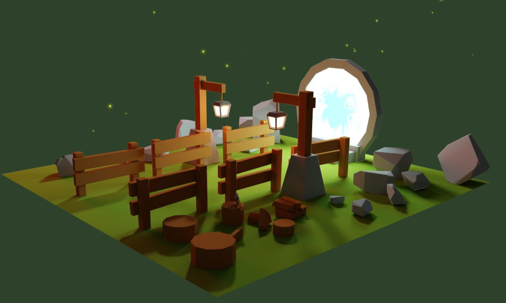
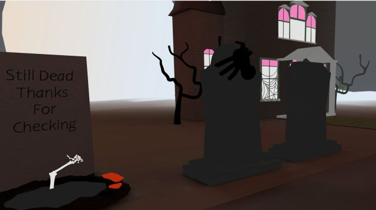
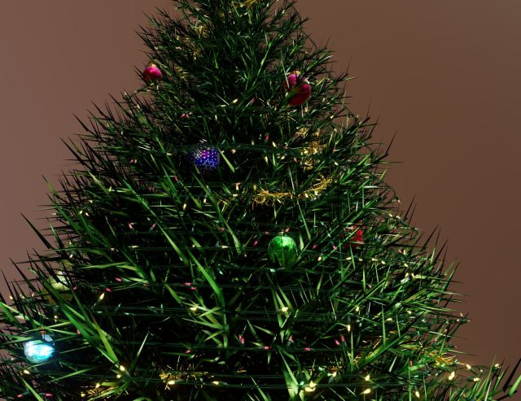
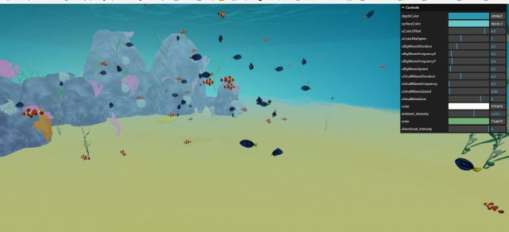

# threejs
Portal scene from the lesson by Bruno Simon in the three.js course https://threejs-journey.com/  
 
 
https://sf5.github.io/threejs/
 
earlier page with study of lights
https://sf5.github.io/threejs/lights/
 
postprocessing effects with leva: https://sf5.github.io/threejs/postprocessing/

  halloween scene 2023
   
   
   
  https://sf5.github.io/threejs/halloween/

  Christmas tree 
   
  https://sf5.github.io/threejs/christmas/

  Isometric room 
   
  https://sf5.github.io/threejs/isometric/

  SeaChallenge 
   
  https://sf5.github.io/threejs/seachallenge
  It takes a few seconds for the rocks to load in the scene
  uses Yuka for the wandering fishes https://mugen87.github.io/yuka/

   christmaswishes 2025 
   
  https://sf5.github.io/threejs/christmaswishes/

